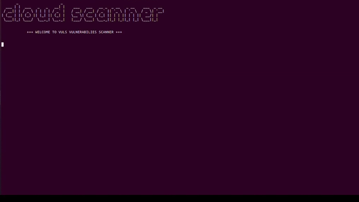

# Red-Detector

## Description
Scan your EC2 instance to find its vulnerabilities using Vuls (https://vuls.io/en/).



## Requirements
1. Configured AWS account with the EC2 actions mentioned below. The policy containing these requirements can be found in red-detector-policy.json.
    1. "AttachVolume"
    2. "AuthorizeSecurityGroupIngress"
    3. "DescribeInstances"
    4. "CreateKeyPair"
    5. "DescribeRegions"
    6. "RunInstances"
    7. "ReportInstanceStatus"
    8. "DescribeSnapshots"
    9. "CreateVolume"
    10. "DescribeAvailabilityZones"
    11. "DescribeVpcs"
    12. "CreateSecurityGroup"
    13. "DescribeVolumes"
    14. "CreateSnapshot"
 

2. Running EC2 instance - Make sure you know the region and instance id of the EC2 instance you would like to scan.
Supported versions:
    - Ubuntu: 14, 16, 18, 19, 20
    - Debian: 6, 8, 9
    - Redhat: 7, 8
    - Suse: 12
    - Amazon: 2
    - Oracle: 8


## Installation
Bash
```bash
sudo git clone https://github.com/lightspin-tech/red-detector.git
pip3 install -r requirements.txt
```


## Usage  
Bash
```bash
cd red-detector
python3 main.py
```

## Flow
1. Run main.py.
2. Region selection: use default region (us-east-1) or select a region.
    Notice that if the selected region does not contain any EC2 instances you will be asked to choose another region.
2. EC2 inatance-id selection: you will get a list of all EC2 instances ids under your selected region and you will be asked to choose the inatance you would like to scan.
    Make sure to choose a valide answer (the number left to the desired id).
3. Track the process progress... It takes about 30 minutes.
4. Get a link to your report!
